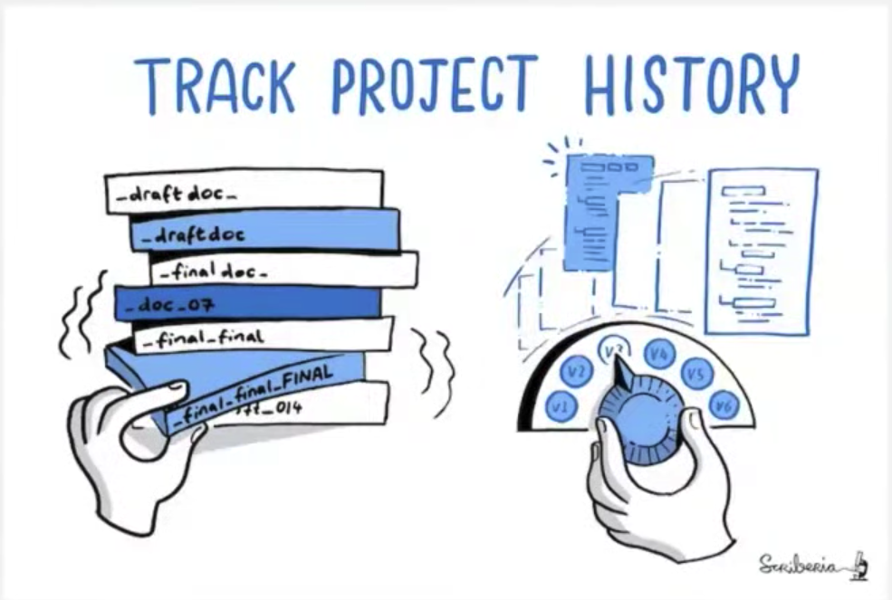
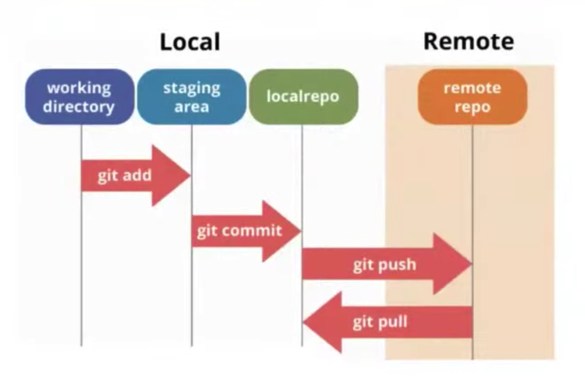

# - Git 101

**Why learn git ?**

* Git is version control system
* Git can be also used for text files
* To organize our data
* Track project history

## Why learn Git and Github

## Open Source

* Source code is available to the public
* Free to use
* Regularly maintained by individuals
* Implementing new features
* Fixing bugs

## Version Control

* Storing versions of the same work or project.
* which is a collection of the changes (history) of the project ( software ).
* Make it possible for the team to be able to communicate the changes they made when working on their designated part.
* it can also serve as a backup of the work that was done.

## Git 
* git is a high quality version control system.
* developed in 2005.
* git is installed in your local system.

## Git Workflow ( 1/6 )
* Local Repository
* Remote

> Local 
> * working directory
> * staging area
> * localrepo

> Remote
> * Remote Repo

### Git Add

save your files in your stagging area

### Git commit 

Add files to your staging area

### Git Push

Push your files to the Remote repo.

### Git Pull

Pull from remote to local.

a